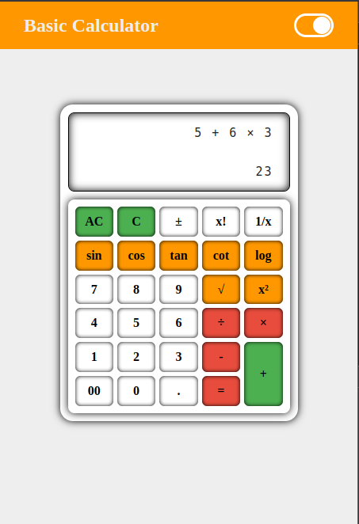
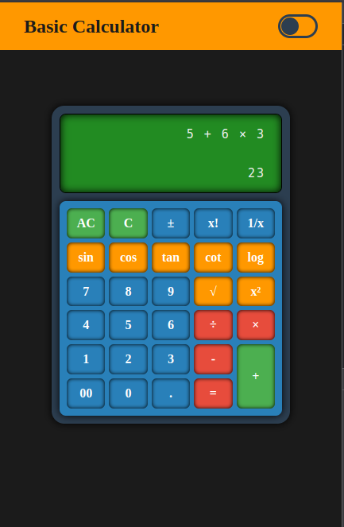

# 🧮 Basic Calculator (Dark/Light Mode)

A simple yet functional calculator web app that supports both dark and light themes. It handles standard arithmetic operations as well as scientific functions like square, power, and trigonometric calculations (sin, cos, tan, cot, log).

---

## 🚀 Demo

[🔗 Show Demo](https://hassanhajizadeh-basic-calculator.netlify.app)

---

## ✨ Features

-   Basic Operations: `+`, `-`, `×`, `÷`
-   Scientific Functions:  
    `sin`, `cos`, `tan`, `cot`, `log`, `square`, `power`
-   Dark and Light Mode Toggle
-   Responsive Design

---

## 🛠️ Built With

-   **HTML**
-   **CSS**
-   **Vanilla JavaScript**

---

## 📸 Screenshots




---

## 📂 How to Use

1. Clone the repository:
    ```bash
    git clone https://github.com/your-username/basic-calculator.git
    ```
2. Open `index.html` in your browser.

---

## 📄 License

This project is open source and available under the [MIT License](LICENSE).
